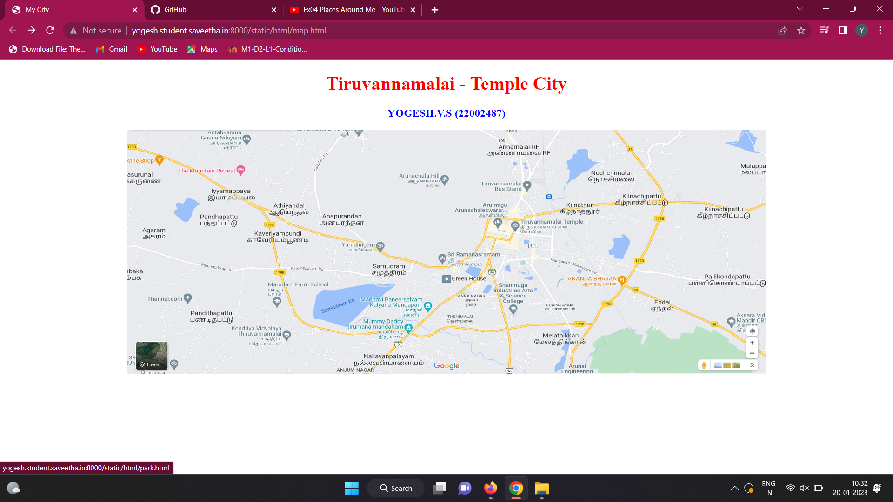
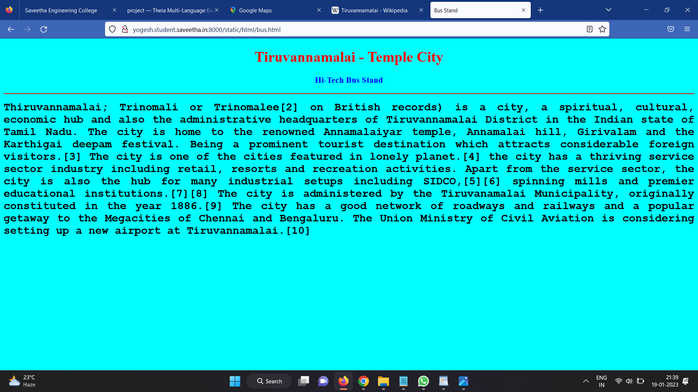
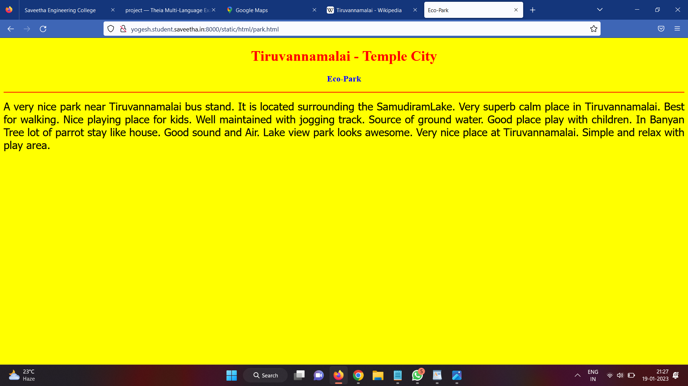
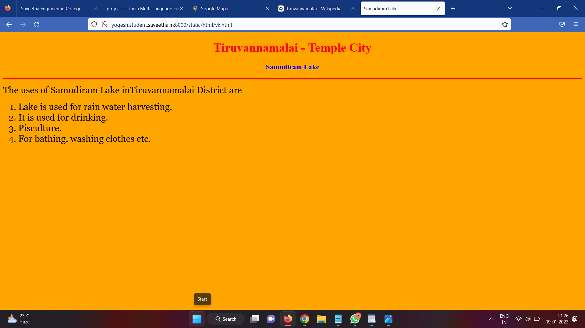
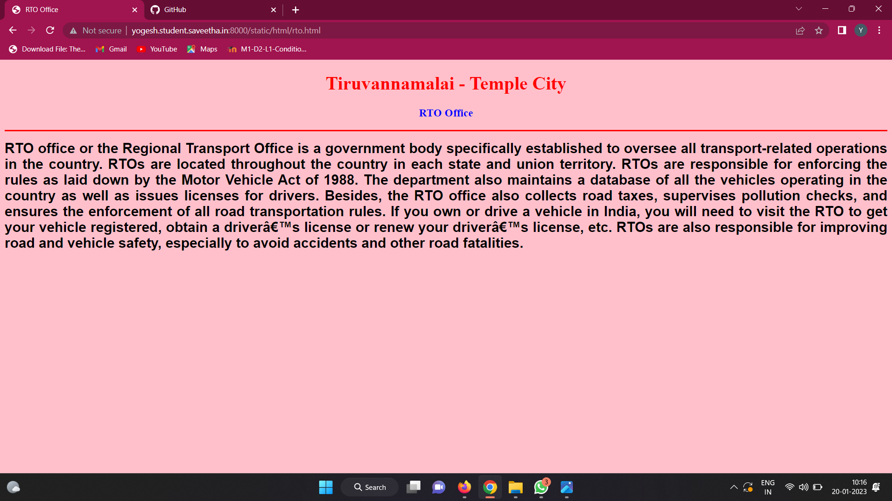
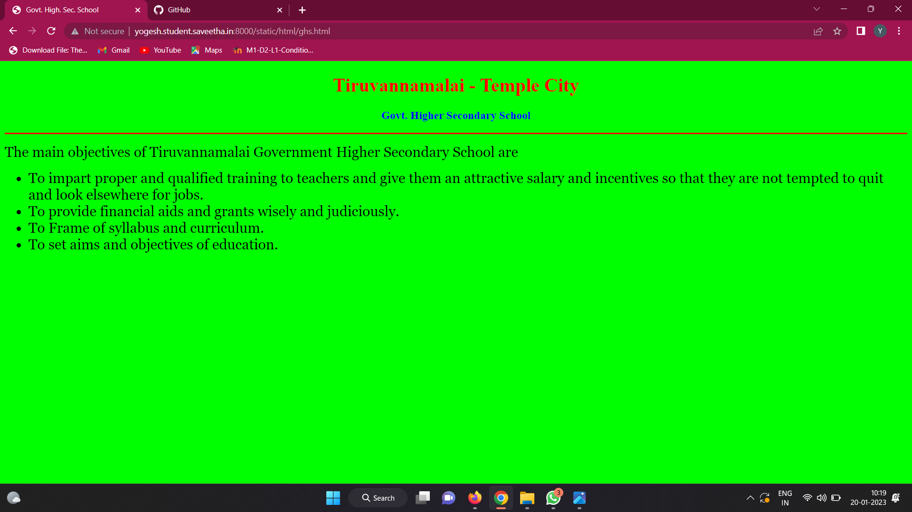
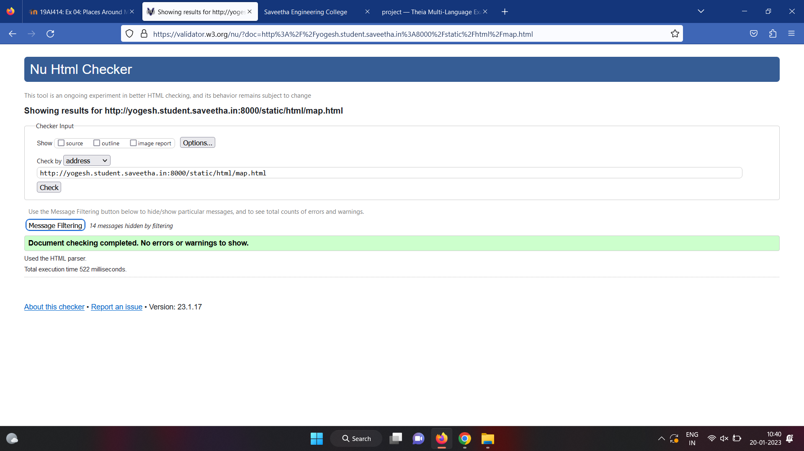

# Places Around Me
## AIM:
To develop a website to display details about the places around my house.

## Design Steps:

### Step 1:
Clone the github repository into Theia IDE.

### Step 2:
Create a new Django project

### Step 3:
Write the needed HTML code.

### Step 4:
Run the Django and executre the HTML files.

## Code:
```
map.html
<!DOCTYPE html>
<html lang="en">
<head>
<title>My City</title>
</head>
<body>
<h1 align="center">
<font color="red"><b>Tiruvannamalai - Temple City</b></font>
</h1>
<h3 align="center">
<font color="blue"><b>YOGESH.V.S (22002487)</b></font>
</h3>
<center>

<map name="MyCity">
<area shape="circle" coords="190,50,20" href="/static/html/ghs.html" title=" Govt. Higher Secondary School">
<area shape="rectangle" coords="230,30,260,60" href="/static/html/rto.html" title="RTO Office">
<area shape="circle" coords="400,350,50" href="/static/html/vk.html" title="Samudiram Lake">
<area shape="circle" coords="400,200,75" href="/static/html/bus.html" title="Hi-Tech Bus Stand">
<area shape="rectangle" coords="490,150,870,320" href="/static/html/park.html" title="Eco-Park">
</map>
</center>
</body>
</html>


bus.html
<!DOCTYPE html>
<html lang="en">
<head>
<title>Bus Stand</title>
</head>
<body bgcolor="cyan">
<h1 align="center">
<font color="red"><b>Tiruvannamalai - Temple City</b></font>
</h1>
<h3 align="center">
<font color="blue"><b>Hi-Tech Bus Stand</b></font>
</h3>
<hr size="3" color="red">
<p align="justify">
<font face="Courier New" size="5">
<b>
Thiruvannamalai; Trinomali or Trinomalee[2] on British records) is a city, a spiritual, cultural, economic hub and also the administrative headquarters of Tiruvannamalai District in the Indian state of Tamil Nadu. The city is home to the renowned Annamalaiyar temple, Annamalai hill, Girivalam and the Karthigai deepam festival. Being a prominent tourist destination which attracts considerable foreign visitors.[3] The city is one of the cities featured in lonely planet.[4] the city has a thriving service sector industry including retail, resorts and recreation activities. Apart from the service sector, the city is also the hub for many industrial setups including SIDCO,[5][6] spinning mills and premier educational institutions.[7][8] The city is administered by the Tiruvanamalai Municipality, originally constituted in the year 1886.[9] The city has a good network of roadways and railways and a popular getaway to the Megacities of Chennai and Bengaluru. The Union Ministry of Civil Aviation is considering setting up a new airport at Tiruvannamalai.[10]</b>
</font>
</p>
</body>
</html>


rto.html
<!DOCTYPE html>
<html lang="en">
<head>
<title>RTO Office</title>
</head>
<body bgcolor="pink">
<h1 align="center">
<font color="red"><b>Tiruvannamalai - Temple City</b></font>
</h1>
<h3 align="center">
<font color="blue"><b>RTO Office</b></font>
</h3>
<hr size="3" color="red">
<p align="justify">
<font face="Arial" size="5">
<b>
RTO office or the Regional Transport Office is a government body specifically established to oversee all transport-related operations in the country. RTOs are located throughout the country in each state and union territory. RTOs are responsible for enforcing the rules as laid down by the Motor Vehicle Act of 1988.
The department also maintains a database of all the vehicles operating in the country as well as issues licenses for drivers. Besides, the RTO office also collects road taxes, supervises pollution checks, and ensures the enforcement of all road transportation rules. If you own or drive a vehicle in India, you will need to visit the RTO to get your vehicle registered, obtain a driver’s license or renew your driver’s license, etc.
RTOs are also responsible for improving road and vehicle safety, especially to avoid accidents and other road fatalities.
</b>
</font>
</p>
</body>
</html>


park.html
<!DOCTYPE html>
<html lang="en">
<head>
<title>Eco-Park</title>
</head>
<body bgcolor="yellow">
<h1 align="center">
<font color="red"><b>Tiruvannamalai - Temple City</b></font>
</h1>
<h3 align="center">
<font color="blue"><b>Eco-Park</b></font>
</h3>
<hr size="3" color="red">
<p align="justify">
<font face="Tahoma" size="5">
A very nice park near Tiruvannamalai bus stand. It is located surrounding the SamudiramLake. 
Very superb calm place in Tiruvannamalai. Best for walking. Nice playing place for kids.
Well maintained with jogging track. Source of ground water.
Good place play with children.  In Banyan Tree lot of parrot stay like house. 
Good sound and Air. Lake view park looks awesome.
Very nice place at Tiruvannamalai.
Simple and relax with play area.
</font>
</p>
</body>
</html>


vk.html
<!DOCTYPE html>
<html lang="en">
<head>
<title>Samudiram Lake</title>
</head>
<body bgcolor="orange">
<h1 align="center">
<font color="red"><b>Tiruvannamalai - Temple City</b></font>
</h1>
<h3 align="center">
<font color="blue"><b>Samudiram Lake</b></font>
</h3>
<hr size="3" color="red">
<p align="justify">
<font face="Georgia" size="5">
The uses of Samudiram Lake inTiruvannamalai District are 
<ol type="1">
<li>Lake is used for rain water harvesting.</li>
<li>It is used for drinking.</li>
<li>Pisculture.</li>
<li>For bathing, washing clothes etc.</li>
</ol>
</font>
</p>
</body>
</html>
```


## Output:












## HTML Validator

## Result:
The program for implementing image mag is executed successfully